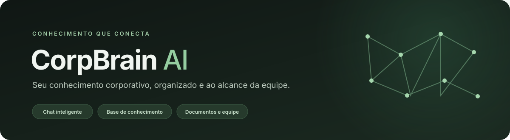

<div align="center">
  
</div>

<p align="center">
  Plataforma web para organizar o conhecimento da empresa e ajudar equipes a encontrar respostas em documentos e processos.
</p>

| **Converse** | **Organize** | **Encontre** |
|:---|:---|:---|
| Chat com IA conectado à base de conhecimento. | Documentos separados por categorias e acessos. | Busca, pré-visualização e download de materiais. |
| **Administre**<br>Usuários, perfis e permissões em um só lugar. | **Acompanhe**<br>Métricas de uso e consultas de baixa confiança. | **Configure**<br>Provedor de IA e chave gerenciados no servidor. |

<p align="center"><sub>Node.js · Express · SQLite · JavaScript</sub></p>

---

## 📸 Visão Geral

O CorpBrain AI reúne chat, documentos e ferramentas de administração em uma única interface para a equipe.

---

## 🏗️ Arquitetura

```
corpbrain-ai/
│
├── public/                          # Frontend (SPA)
│   ├── index.html                   # Estrutura HTML principal
│   ├── styles.css                   # Design system completo (dark mode, glassmorphism)
│   └── app.js                       # Lógica do frontend (API client, navegação, chat, etc.)
│
├── server/                          # Backend Node.js
│   ├── server.js                    # Express server principal
│   ├── database.js                  # SQLite (sql.js) + seed de dados
│   ├── middleware/
│   │   └── auth.js                  # Middlewares JWT (auth + admin)
│   ├── routes/
│   │   ├── auth.js                  # Login + sessão (/me)
│   │   ├── users.js                 # CRUD de usuários
│   │   ├── categories.js            # CRUD de categorias (blocos de conhecimento)
│   │   └── files.js                 # Upload, download, preview e exclusão de arquivos
│   └── uploads/                     # Armazenamento físico dos arquivos enviados
│
├── corpbrain.db                     # Banco SQLite (gerado automaticamente)
├── package.json
├── .gitignore
└── README.md
```

---

## 🛠️ Stack Tecnológica

| Camada       | Tecnologia                                       |
| ------------ | ------------------------------------------------ |
| **Frontend** | HTML5 + CSS3 + JavaScript puro (SPA)             |
| **Backend**  | Node.js + Express 4                              |
| **Banco**    | SQLite via [sql.js](https://github.com/sql-js/sql.js) (puro JS, sem compilação nativa) |
| **Auth**     | JWT (`jsonwebtoken`) + bcrypt (`bcryptjs`)        |
| **Upload**   | `multer` (multipart/form-data, nomes UUID)       |
| **PDF**      | `pdf-parse` v2 (extração de texto via PDFParse)  |
| **Ícones**   | [Lucide Icons](https://lucide.dev/) (via CDN)    |

---

## 🚀 Instalação e Execução

### Pré-requisitos

- **Node.js** v18+ (testado com v24)
- **npm** v9+

### Setup

```bash
# Clone ou navegue até o diretório do projeto
cd corpbrain-ai

# Instala dependências
npm install

# Inicia o servidor
npm start
```

O servidor será iniciado em **http://localhost:3000**.

### Modo desenvolvimento (auto-reload)

```bash
npm run dev
```

> Usa `node --watch` para reiniciar automaticamente ao salvar alterações nos arquivos do servidor.

---

## 🔐 Credenciais iniciais

O banco de dados é populado automaticamente com dados de demonstração na primeira execução:

Na primeira inicialização, o servidor gera senhas aleatórias para as contas
`admin@example.com` e `user@example.com` e grava-as temporariamente em
`server/.initial-credentials`. Altere as senhas pela tela de gerenciamento de
usuários e remova esse arquivo depois. Em ambientes novos, também é possível
definir `INITIAL_ADMIN_PASSWORD` e `INITIAL_USER_PASSWORD` antes da primeira execução.

A API key da IA é criptografada com uma chave independente, gerada em
`server/.ai-encryption-key`. Preserve esse arquivo (ou defina `AI_ENCRYPTION_KEY`)
ao mover ou restaurar a aplicação; sem ele, a API key precisará ser cadastrada novamente.

Em produção, publique o servidor atrás de um reverse proxy com HTTPS e defina
`NODE_ENV=production`; nesse modo, requisições HTTP à API são rejeitadas.

> **Admin** tem acesso a: uploads, gerenciamento de usuários, criação/exclusão de categorias.  
> **Usuário** tem acesso a: chat, consulta à base de conhecimento, download de arquivos.

---

## 📡 API REST

Todas as rotas são prefixadas com `/api`. As respostas são em JSON.

### Autenticação

| Método | Endpoint          | Auth | Descrição                      |
| ------ | ----------------- | ---- | ------------------------------ |
| POST   | `/api/auth/login` | ✗    | Login (retorna JWT + user)     |
| GET    | `/api/auth/me`    | ✓    | Dados do usuário autenticado   |

**Login:**
```bash
curl -X POST http://localhost:3000/api/auth/login \
  -H "Content-Type: application/json" \
  -d '{"email":"admin@example.com","password":"SENHA_LIDA_DO_ARQUIVO_INITIAL_CREDENTIALS"}'
```

**Resposta:**
```json
{
  "token": "eyJhbGci...",
  "user": {
    "id": 1,
    "email": "admin@example.com",
    "role": "admin",
    "name": "Demo Admin",
    "initials": "MC",
    "title": "Administrador"
  }
}
```

### Usuários

| Método | Endpoint         | Auth | Admin | Descrição            |
| ------ | ---------------- | ---- | ----- | -------------------- |
| GET    | `/api/users`     | ✓    | ✓     | Lista todos          |
| POST   | `/api/users`     | ✓    | ✓     | Cria novo            |
| PUT    | `/api/users/:id` | ✓    | ✓     | Atualiza             |
| DELETE | `/api/users/:id` | ✓    | ✓     | Remove (não a si mesmo) |

### Categorias (Blocos de Conhecimento)

| Método | Endpoint              | Auth | Admin | Descrição                            |
| ------ | --------------------- | ---- | ----- | ------------------------------------ |
| GET    | `/api/categories`     | ✓    | ✗     | Lista categorias com contagem de arquivos |
| POST   | `/api/categories`     | ✓    | ✓     | Cria categoria                       |
| PUT    | `/api/categories/:id` | ✓    | ✓     | Atualiza                             |
| DELETE | `/api/categories/:id` | ✓    | ✓     | Remove categoria + todos os arquivos |

### Arquivos

| Método | Endpoint                   | Auth | Admin | Descrição                              |
| ------ | -------------------------- | ---- | ----- | -------------------------------------- |
| GET    | `/api/files`               | ✓    | ✗     | Lista arquivos (`?category=key`)       |
| POST   | `/api/files/upload`        | ✓    | ✓     | Upload (multipart, campo `file` + `category`) |
| GET    | `/api/files/:id/preview`   | ✓    | ✗     | Extrai e retorna conteúdo textual      |
| GET    | `/api/files/:id/download`  | ✓    | ✗     | Download do arquivo original           |
| DELETE | `/api/files/:id`           | ✓    | ✓     | Remove arquivo do banco e disco        |

**Upload de arquivo:**
```bash
curl -X POST http://localhost:3000/api/files/upload \
  -H "Authorization: Bearer <token>" \
  -F "file=@documento.pdf" \
  -F "category=produtos"
```

**Preview (extração de texto):**
```bash
curl http://localhost:3000/api/files/24/preview \
  -H "Authorization: Bearer <token>"
```
```json
{
  "type": "pdf",
  "text": "Política de Licença Parental...",
  "pages": 3,
  "info": {}
}
```

---

## 📦 Dados de Seed

Na primeira execução, o sistema cria automaticamente:

### Categorias

| Chave          | Label          | Ícone       | Arquivos demo |
| -------------- | -------------- | ----------- | ------------- |
| `produtos`     | Produtos       | `box`       | 8             |
| `processos`    | Processos      | `git-branch`| 8             |
| `apresentacoes`| Apresentações  | `monitor`   | 7             |

### Arquivos de demonstração

- **Produtos**: Fichas técnicas, tabela de preços, FAQ comercial, catálogo geral, etc.
- **Processos**: Manual de reembolso, guia de onboarding, política de viagens, código de ética, etc.
- **Apresentações**: Deck institucional, cases de sucesso, manual de marca, templates, etc.

> Os arquivos de seed são registros no banco de dados apenas (sem arquivos físicos no disco). Arquivos reais são criados via upload.

---

## 🔧 Configuração

### Variáveis de Ambiente

| Variável     | Padrão                       | Descrição                   |
| ------------ | ---------------------------- | --------------------------- |
| `PORT`       | `3000`                       | Porta do servidor           |
| `JWT_SECRET` | gerado aleatoriamente na primeira execução | Segredo para assinar tokens |

### Limites

- **Upload máximo**: 50 MB por arquivo
- **Token JWT**: Expira em 7 dias
- **Formatos de preview**: PDF (extração de texto), TXT, CSV, MD, JSON, XML, HTML, LOG, YAML

---

## 🗄️ Banco de Dados

O SQLite é utilizado via `sql.js` (implementação pura em JavaScript/WASM, sem necessidade de compilação nativa nem Visual Studio).

### Tabelas

```sql
-- Usuários
CREATE TABLE users (
    id INTEGER PRIMARY KEY AUTOINCREMENT,
    email TEXT UNIQUE NOT NULL,
    password TEXT NOT NULL,          -- hash bcrypt
    role TEXT DEFAULT 'user',        -- 'admin' | 'user'
    name TEXT NOT NULL,
    initials TEXT,
    title TEXT,
    created_at DATETIME DEFAULT CURRENT_TIMESTAMP
);

-- Categorias (blocos de conhecimento)
CREATE TABLE categories (
    id INTEGER PRIMARY KEY AUTOINCREMENT,
    key TEXT UNIQUE NOT NULL,        -- identificador slug
    label TEXT NOT NULL,             -- nome de exibição
    description TEXT,
    icon TEXT DEFAULT 'folder',      -- nome do ícone Lucide
    color TEXT DEFAULT 'produtos',   -- classe CSS de cor
    created_at DATETIME DEFAULT CURRENT_TIMESTAMP
);

-- Arquivos
CREATE TABLE files (
    id INTEGER PRIMARY KEY AUTOINCREMENT,
    category_id INTEGER NOT NULL,
    original_name TEXT NOT NULL,      -- nome original do arquivo
    stored_name TEXT NOT NULL,        -- nome UUID no disco
    description TEXT,
    tags TEXT DEFAULT '[]',           -- JSON array de tags
    size TEXT,
    ext TEXT,
    mime_type TEXT,
    created_at DATETIME DEFAULT CURRENT_TIMESTAMP,
    FOREIGN KEY (category_id) REFERENCES categories(id) ON DELETE CASCADE
);
```

O banco é salvo automaticamente em `corpbrain.db` na raiz do projeto após cada operação de escrita.

---

## 🎨 Frontend

O frontend é uma SPA construída em JavaScript puro, sem frameworks. Principais funcionalidades:

- **Sistema de Navegação**: Menu lateral com navegação entre páginas (Chat, Base de Conhecimento, Uploads, Analytics, Usuários, Configurações)
- **Chat com IA**: Interface conversacional com sugestões, histórico e animações de digitação
- **Base de Conhecimento**: Visualização em cards por categoria com busca e filtros
- **Visualizador de Documentos**: Modal com extração de texto real de PDFs e download
- **Upload com Progresso**: Drag-and-drop com barra de progresso e feedback visual
- **Gerenciamento de Usuários**: Modal de criação/edição com validação
- **Tema Dark**: Design glassmorphism com gradientes e micro-animações
- **Responsivo**: Layout adaptável com sidebar colapsável para mobile
- **Toast Notifications**: Feedback visual para todas as ações

### API Client

O frontend utiliza um módulo `API` que encapsula todas as chamadas HTTP com autenticação JWT automática:

```javascript
const API = {
    get(url)           // GET com auth header
    post(url, body)    // POST JSON com auth header
    put(url, body)     // PUT JSON com auth header
    delete(url)        // DELETE com auth header
    upload(url, formData) // POST multipart com auth header
};
```

---

## 🔮 Próximos Passos

> Estado verificado no código: o chat já faz recuperação lexical por palavras-chave sobre textos extraídos e envia trechos selecionados ao provedor configurado. Isso é um RAG lexical, não uma busca semântica por embeddings. Ainda não há um conjunto de perguntas/respostas de referência nem métricas automatizadas de recuperação ou qualidade da resposta.

Para executar os testes automatizados:

```bash
npm test
```

- [ ] Integração com API de IA (OpenAI / Gemini / Claude) para chat inteligente
- [ ] Busca semântica na base de conhecimento
- [ ] Indexação automática de documentos no upload
- [ ] Histórico de conversas persistido no banco
- [ ] Logs de auditoria (quem acessou o quê)
- [ ] Exportação de relatórios

---

## 📄 Licença

Projeto interno — uso corporativo.
